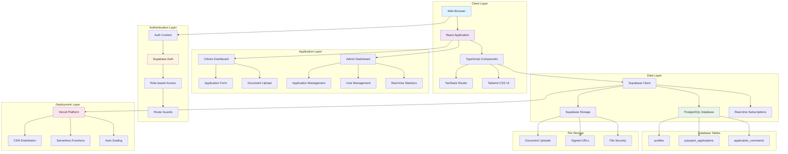
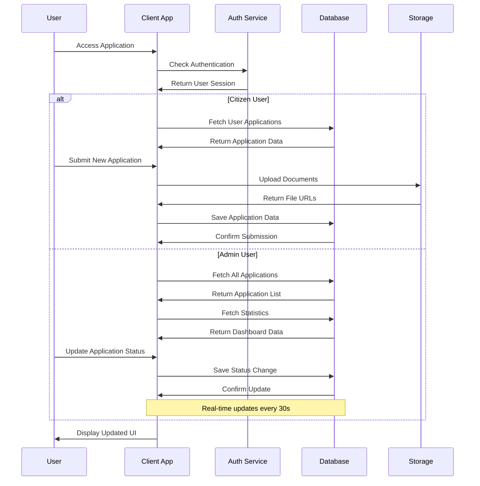
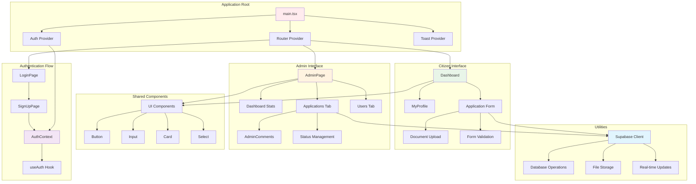

# System Architecture Diagram

```mermaid
graph TB
    subgraph "Client Layer"
        A[Web Browser] --> B[React Application]
        B --> C[TypeScript Components]
        C --> D[TanStack Router]
        C --> E[Tailwind CSS UI]
    end
    
    subgraph "Authentication Layer"
        F[Auth Context] --> G[Supabase Auth]
        G --> H[Role-based Access]
        H --> I[Route Guards]
    end
    
    subgraph "Application Layer"
        J[Citizen Dashboard] --> K[Application Form]
        J --> L[Document Upload]
        M[Admin Dashboard] --> N[Application Management]
        M --> O[User Management]
        M --> P[Real-time Statistics]
    end
    
    subgraph "Data Layer"
        Q[Supabase Client] --> R[PostgreSQL Database]
        Q --> S[Supabase Storage]
        Q --> T[Real-time Subscriptions]
    end
    
    subgraph "Database Tables"
        R --> U[profiles]
        R --> V[passport_applications]
        R --> W[application_comments]
    end
    
    subgraph "File Storage"
        S --> X[Document Uploads]
        S --> Y[Signed URLs]
        S --> Z[File Security]
    end
    
    subgraph "Deployment Layer"
        AA[Vercel Platform] --> BB[CDN Distribution]
        AA --> CC[Serverless Functions]
        AA --> DD[Auto Scaling]
    end
    
    A --> F
    B --> J
    B --> M
    C --> Q
    Q --> AA
    
    style A fill:#e1f5fe
    style B fill:#f3e5f5
    style G fill:#fff3e0
    style R fill:#e8f5e8
    style AA fill:#fce4ec
```

# Data Flow Diagram

```mermaid
sequenceDiagram
    participant U as User
    participant C as Client App
    participant A as Auth Service
    participant D as Database
    participant S as Storage
    
    U->>C: Access Application
    C->>A: Check Authentication
    A->>C: Return User Session
    
    alt Citizen User
        C->>D: Fetch User Applications
        D->>C: Return Application Data
        U->>C: Submit New Application
        C->>S: Upload Documents
        S->>C: Return File URLs
        C->>D: Save Application Data
        D->>C: Confirm Submission
    
    else Admin User
        C->>D: Fetch All Applications
        D->>C: Return Application List
        C->>D: Fetch Statistics
        D->>C: Return Dashboard Data
        U->>C: Update Application Status
        C->>D: Save Status Change
        D->>C: Confirm Update
        Note over C,D: Real-time updates every 30s
    end
    
    C->>U: Display Updated UI
```

# Component Architecture

```mermaid
graph TD
    subgraph "Application Root"
        A[main.tsx] --> B[Router Provider]
        A --> C[Auth Provider]
        A --> D[Toast Provider]
    end
    
    subgraph "Authentication Flow"
        E[LoginPage] --> F[SignUpPage]
        F --> G[AuthContext]
        G --> H[useAuth Hook]
    end
    
    subgraph "Citizen Interface"
        I[Dashboard] --> J[MyProfile]
        I --> K[Application Form]
        K --> L[Document Upload]
        K --> M[Form Validation]
    end
    
    subgraph "Admin Interface"
        N[AdminPage] --> O[Dashboard Stats]
        N --> P[Applications Tab]
        N --> Q[Users Tab]
        P --> R[AdminComments]
        P --> S[Status Management]
    end
    
    subgraph "Shared Components"
        T[UI Components] --> U[Button]
        T --> V[Input]
        T --> W[Card]
        T --> X[Select]
    end
    
    subgraph "Utilities"
        Y[Supabase Client] --> Z[Database Operations]
        Y --> AA[File Storage]
        Y --> BB[Real-time Updates]
    end
    
    B --> E
    B --> I
    B --> N
    C --> G
    I --> T
    N --> T
    K --> Y
    P --> Y
    
    style A fill:#ffebee
    style G fill:#f3e5f5
    style I fill:#e8f5e8
    style N fill:#fff3e0
    style Y fill:#e1f5fe
```
