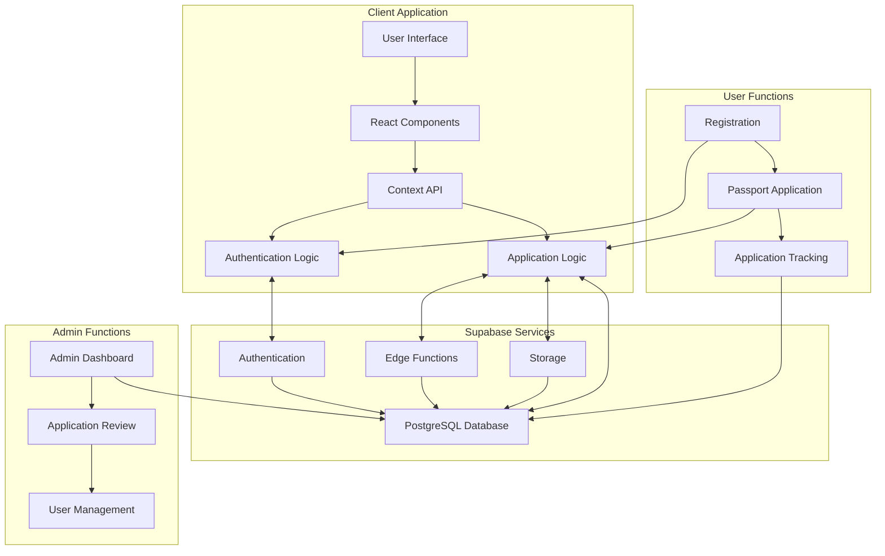
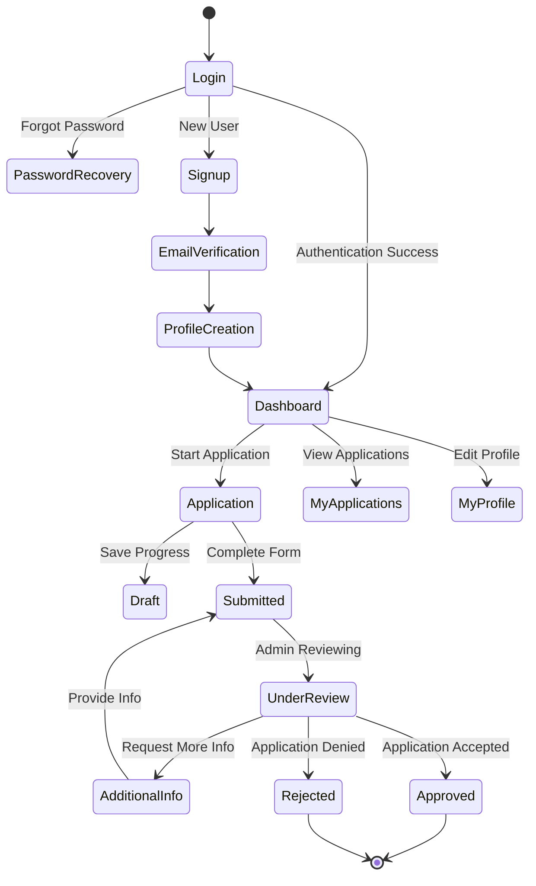
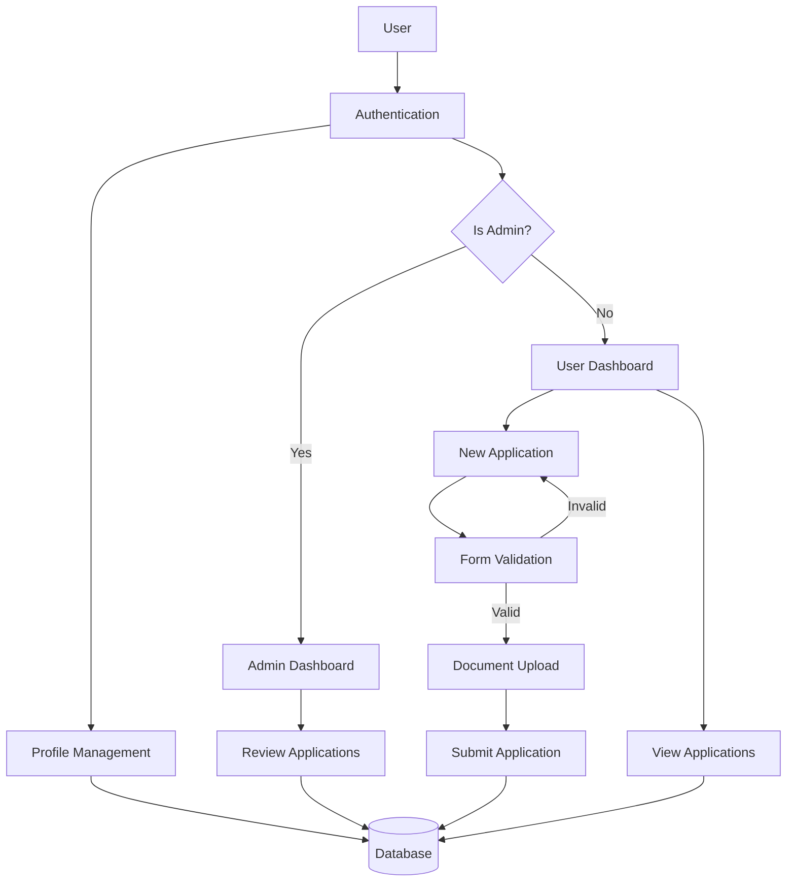

# React Passport Site: Comprehensive System Analysis Report

*Generated: June 10, 2025*

## Table of Contents
1. [System Overview](#system-overview)
2. [Architecture](#architecture)
3. [Authentication System](#authentication-system)
4. [User Management](#user-management)
5. [Application Flow](#application-flow)
6. [Security Implementation](#security-implementation)
7. [Database Structure](#database-structure)
8. [Core Features](#core-features)
9. [Supabase Edge Functions](#supabase-edge-functions)
10. [Navigation & Routing](#navigation--routing)
11. [Component Analysis](#component-analysis)
12. [Performance Considerations](#performance-considerations)
13. [Recommendations](#recommendations)
14. [System Visualization](#system-visualization)

## System Overview

The RMI Passport Portal is a comprehensive web application built for the Republic of the Marshall Islands to manage citizen passport applications. The system provides end-to-end functionality for passport applications, from user registration through final approval, with distinct workflows for applicants and administrators.

### Technology Stack
- **Frontend**: React 18 with TypeScript and TailwindCSS
- **Build Tool**: Vite 6
- **Routing**: TanStack Router (previously React Router)
- **Backend/Database**: Supabase (Authentication, Storage, Database, Edge Functions)
- **State Management**: React Context API with custom hooks
- **Notifications**: React-Hot-Toast
- **UI Components**: Custom components built on Radix UI primitives
- **Maps/Visualization**: React Leaflet, D3-geo, D3-scale

## Architecture

The application follows a modern client-side architecture with serverless backend services:

### Client Architecture
- **Component-Based Design**: Modular React components with separation of concerns
- **Context API**: For global state management (authentication, user profiles)
- **Custom Hooks**: Encapsulating reusable logic and side effects
- **TypeScript**: Strong typing throughout the codebase for better reliability
- **Responsive Design**: Using TailwindCSS for adaptive layouts on all devices

### Backend Architecture
- **Supabase Authentication**: Handles user registration, login, and session management
- **Supabase Database**: PostgreSQL database for storing user profiles, applications, and system data
- **Supabase Edge Functions**: Serverless functions for secure operations like email verification
- **Supabase Storage**: For document uploads (birth certificates, photos, etc.)

## Authentication System

### Login Flow
1. User enters email and password
2. Application validates input and sends to Supabase Auth
3. System clears any existing sessions
4. Authenticates with Supabase using email/password
5. Verification of active session with multiple retries for reliability
6. Loads user profile data from the database
7. If profile doesn't exist, creates one automatically
8. Redirects based on user role (admin or regular user)

### Registration Flow
The signup process involves multiple steps with robust security measures:

1. **Legal Consent**: User must accept legal terms related to passport requirements
2. **Email Verification**: 
   - User provides email address
   - System sends verification code with rate limiting protection
   - User enters verification code
   - System validates code and creates account only after verification
3. **Profile Creation**: Collects user details (name, DOB, gender, phone)
4. **Password Setup**: Secure password creation with confirmation
5. **Completion**: Email confirmation and redirect to login

### Password Recovery
1. User requests recovery by providing email
2. System sends recovery link (without confirming email exists for security)
3. User clicks link with embedded reset token
4. System validates token and allows password reset
5. User creates and confirms new password
6. System updates credentials and redirects to login

## User Management

### Profiles System
- Separate profile records linked to Supabase Auth users
- Automatic profile creation during first login
- Profile data synchronized with auth metadata
- Role-based access control (admin vs. regular users)

### User Roles
- **Regular Users**: Can submit and track applications
- **Administrators**: Review applications, manage system, access statistics

### Profile Data
- Personal information (name, DOB, gender)
- Contact information (email, phone)
- System metadata (role, creation timestamp)

## Application Flow

### Passport Application Process
1. **Initiation**: User starts new application from dashboard
2. **Form Completion**: Multi-step form with various sections:
   - Personal Information
   - Physical Characteristics
   - Address Information
   - Emergency Contacts
   - Parental Information
   - Document Uploads
3. **Submission**: Application marked as submitted and queued for review
4. **Review**: Admin reviews application and documents
5. **Decision**: Application approved, rejected, or additional information requested
6. **Notification**: User notified of application status changes
7. **Tracking**: User can track application progress throughout the process

### Application States
- **Draft**: In progress, not submitted
- **Submitted**: Awaiting administrative review
- **Under Review**: Currently being evaluated
- **Additional Info Requested**: Waiting for applicant to provide more information
- **Approved**: Application accepted, passport processing
- **Rejected**: Application denied with reason
- **Completed**: Process finished, passport issued

## Security Implementation

### Rate Limiting System
A sophisticated rate limiting system protects against abuse and attacks:

- **Per-Email Limits**: 5 verification requests per email in 60-minute window
- **Per-IP Limits**: 10 verification requests per IP in 60-minute window
- **Database Tracking**: All verification attempts recorded for limit enforcement
- **Client-Side Feedback**: Users see countdown timers when rate limited
- **Server-Side Implementation**: Edge functions enforce limits with proper HTTP status codes
- **Graceful Degradation**: System defaults to allowing requests if rate tracking fails

### Data Protection
- **Row-Level Security**: Supabase RLS policies restrict data access
- **Environment Variables**: Sensitive keys and URLs protected
- **Code Exposure Prevention**: Verification codes hidden in production mode
- **Secure Password Storage**: Bcrypt hashing through Supabase Auth

## Database Structure

### Main Tables
1. **auth.users**: Supabase Auth user records
2. **profiles**: Extended user information
   - Linked to auth.users by user ID
   - Contains personal information and role
3. **passport_applications**: Core application data
   - Comprehensive fields for all application information
   - Status tracking and timestamps
4. **recovery_codes**: Email verification and recovery codes
   - Code storage with expiration and usage tracking
5. **rate_limit_requests**: Security tracking
   - Email and IP-based request tracking
   - Timestamp-based window limiting

### Database Security
- Row-Level Security (RLS) policies for all tables
- Service role access control for administrative functions
- Scheduled cleanup processes for temporary data
- Indices on frequently queried columns for performance

## Core Features

### Dashboard
- Application status overview
- Progress tracking with visual indicators
- Quick actions for common tasks
- Recent activity display

### Application Form
- Multi-step form with progress saving
- Comprehensive data collection
- Document upload capabilities
- Digital signature support
- Validation with user-friendly feedback

### Admin Console
- Application review interface
- User management tools
- System statistics and metrics
- Geographic distribution visualization
- Decision workflow with comments

### Document Management
- Secure document upload
- Multiple document type support
- File validation and size restrictions
- Preview capabilities

## Supabase Edge Functions

### send-verification
- Generates one-time verification codes
- Implements rate limiting logic
- Sends emails via configured mail provider
- Returns appropriate status codes and responses
- Includes security headers and CORS configuration

### delete-user
- Secure user deletion capability
- Administrative function for account management
- Ensures proper cleanup of related records
- Access controlled through service role

## Navigation & Routing

The application uses TanStack Router with a comprehensive route structure:

- **/** - Default route to login
- **/login** - Authentication screen
- **/signup** - Multi-step registration flow
- **/dashboard** - Main user interface after login
- **/apply** - Passport application form
- **/my-applications** - List of user's applications
- **/my-profile** - User profile management
- **/admin** - Administrative dashboard and tools
- **/photo-guidelines** - Documentation for passport photos
- **/recover-password** - Password recovery request
- **/reset-password** - Password reset with token

## Component Analysis

### Authentication Components
- **LoginPage**: User authentication with error handling
- **SignUpPage**: Multi-step registration process
- **PasswordRecoveryPage**: Initiates password reset
- **PasswordResetPage**: Completes password reset flow

### Application Components
- **Dashboard**: Main user interface after login
- **Application**: Comprehensive application form
- **MyApplicationsPage**: Application history and tracking
- **MyProfile**: User profile management

### Administrative Components
- **AdminPage**: Complete admin dashboard
- **AdminComments**: Communication system for applications

### UI Components
- **Button**: Custom button component with variants
- **Card**: Styled content containers
- **Input**: Enhanced form inputs with labels
- **Label**: Accessible form labels
- **Select**: Dropdown selection component

### Context Providers
- **AuthContext**: Authentication state and methods
- **ToastContext**: Notification system via custom hook

## Performance Considerations

### Optimization Techniques
- Component memoization for rendering performance
- Database indices on frequently queried columns
- Rate limiting to prevent system overload
- Batched database operations for efficiency

### Loading States
- Visual feedback during asynchronous operations
- Fallback content during data loading
- Retry mechanisms for unreliable connections
- Graceful error handling with user feedback

## Recommendations

### Potential Enhancements
1. **Two-Factor Authentication**: Add optional 2FA for increased security
2. **Offline Support**: Implement Progressive Web App capabilities
3. **Analytics Dashboard**: Enhanced metrics for administrative users
4. **Automated Testing**: Comprehensive test suite for reliability
5. **Accessibility Audit**: Ensure WCAG compliance for all users
6. **Mobile Application**: Native app version for better mobile experience
7. **Internationalization**: Multi-language support for diverse users
8. **Advanced Search**: Enhanced filtering for administrators

### Security Improvements
1. **Security Headers**: Comprehensive security header implementation
2. **CAPTCHA Integration**: Additional protection for sensitive operations
3. **Regular Security Audits**: Scheduled code and configuration reviews
4. **Enhanced Logging**: More detailed security event tracking

## System Visualization

### Architecture Diagram

### User Flow Diagram

### Data Flow Diagram

This comprehensive analysis provides a detailed overview of the RMI Passport Portal system architecture, functionality, and technical implementation. The included diagrams visualize key aspects of the system flow and structure to aid in understanding the complete application.
